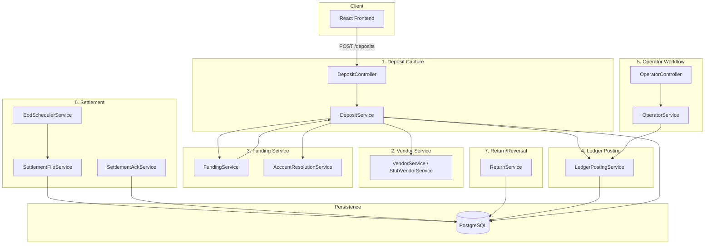
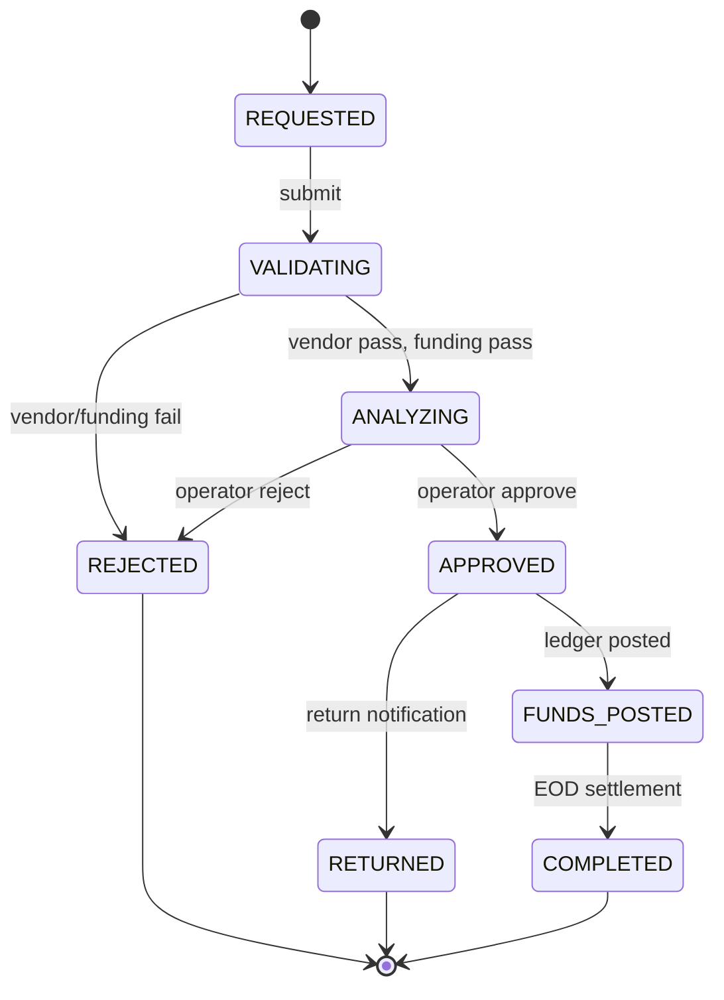

# Architecture Document

Mobile Check Deposit System — Modular Monolith

This document describes the system architecture, component boundaries, data flow, and schema for the Apex Fintech Mobile Check Deposit System. A third-party evaluator should be able to understand all system boundaries from this document alone.

---

## 1. System Diagram

The system is a modular monolith with exactly **7 named components**. All components run in a single Spring Boot process; communication is via direct method calls, not network hops.



### ASCII Alternative

```
┌─────────────────────────────────────────────────────────────────────────────────┐
│                           React Frontend (Vite :5173)                             │
└─────────────────────────────────────────────────────────────────────────────────┘
                                        │
                                        ▼
┌─────────────────────────────────────────────────────────────────────────────────┐
│ 1. DEPOSIT CAPTURE          │ DepositController, DepositService                  │
│    - Receives POST /deposits, orchestrates flow, handles retries                 │
└─────────────────────────────────────────────────────────────────────────────────┘
        │                    │                    │
        ▼                    ▼                    ▼
┌───────────────┐   ┌───────────────────┐   ┌─────────────────────────────────────┐
│ 2. VENDOR     │   │ 3. FUNDING        │   │ 4. LEDGER POSTING                    │
│    SERVICE    │   │    SERVICE        │   │    LedgerPostingService             │
│ StubVendorSvc │   │ FundingService,   │   │ Double-entry: debit omnibus,         │
│ IQA, MICR,   │   │ AccountResolution │   │ credit investor                     │
│ OCR, dup det │   │ Max $5k, routing  │   └─────────────────────────────────────┘
└───────────────┘   └───────────────────┘              ▲
        │                    │                         │
        └────────────────────┴─────────────────────────┘
                                        │
                                        ▼
┌─────────────────────────────────────────────────────────────────────────────────┐
│ 5. OPERATOR WORKFLOW       │ OperatorService, OperatorController                 │
│    - Queue, approve, reject, contribution override                               │
└─────────────────────────────────────────────────────────────────────────────────┘
                                        │
                                        ▼
┌─────────────────────────────────────────────────────────────────────────────────┐
│ 6. SETTLEMENT              │ EodSchedulerService, SettlementFileService,         │
│    - EOD cron, X9 ICL JSON file, SettlementAckService                           │
└─────────────────────────────────────────────────────────────────────────────────┘
                                        │
                                        ▼
┌─────────────────────────────────────────────────────────────────────────────────┐
│ 7. RETURN/REVERSAL         │ ReturnService                                        │
│    - POST /internal/returns → reversal entries, $30 fee, RETURNED state         │
└─────────────────────────────────────────────────────────────────────────────────┘
                                        │
                                        ▼
┌─────────────────────────────────────────────────────────────────────────────────┐
│                           PostgreSQL                                             │
│  transfers, ledger_entries, audit_logs, trace_events, accounts, settlement_batch │
└─────────────────────────────────────────────────────────────────────────────────┘
```

---

## 2. Service Boundaries

Each component owns specific responsibilities and explicitly does **not** own others.

| Component | Owns | Does NOT Own |
|-----------|------|--------------|
| **1. Deposit Capture** | HTTP request/response handling, orchestration of submit/retry flow, calling Vendor → Funding → Ledger in sequence, persistence of Transfer records | Vendor assessment logic, business rules, ledger double-entry semantics, operator queue logic |
| **2. Vendor Service** | Image quality assessment (IQA), MICR extraction, OCR amount recognition, duplicate detection, scenario selection (via `X-Account-Id`), `VendorAssessmentResult` shape | Funding rules, ledger posting, operator workflow, settlement file format |
| **3. Funding Service** | Routing number match, max deposit amount ($5k), contribution type defaults, internal duplicate detection window, `FundingValidationResult` | Vendor stub implementation, ledger posting, operator approve/reject, settlement timing |
| **4. Ledger Posting** | Double-entry semantics (debit omnibus, credit investor), `transactionId` pairing, Transfer state → APPROVED | Vendor/Funding validation, operator queue, settlement file generation, return fee logic |
| **5. Operator Workflow** | Queue filtering (status, date, account, amount), approve/reject actions, contribution type override, audit log entries for operator actions | Deposit submission flow, Vendor/Funding logic, ledger double-entry, settlement file content |
| **6. Settlement** | EOD cron schedule, next-business-day rollover, X9 ICL JSON file generation, batch metadata, ack tracking, Transfer → COMPLETED | Vendor/Funding, ledger posting, return handling |
| **7. Return/Reversal** | Reversal ledger entries (debit investor, credit omnibus), $30 fee entry, Transfer → RETURNED, `INVESTOR_NOTIFIED` audit event | Deposit flow, Vendor/Funding, operator queue, settlement file |

---

## 3. Data Flow Narrative

### End-to-End: Deposit Submission → Settlement Completion

1. **Investor submits deposit**  
   React sends `POST /deposits` with `frontImage`, `backImage`, `amount`, `accountId`. `X-Account-Id` and `X-User-Role: INVESTOR` headers identify the caller.

2. **Deposit Capture**  
   `DepositController` receives the request. `DepositService.submit()` resolves the account via `AccountResolutionService` (toAccountId, fromAccountId/omnibus).

3. **Vendor assessment**  
   `VendorService.assessCheck()` (StubVendorService) runs IQA, MICR, OCR. Scenario is selected by `X-Account-Id` (e.g. `iqa-blur`, `clean-pass`). On IQA failure or duplicate, returns 422 with `actionableMessage`. On pass, returns `VendorAssessmentResult` with `micrData`, `ocrAmount`, `vendorScore`.

4. **Funding validation**  
   `FundingService.validate()` enforces: routing match, max $5k, contribution type defaults, internal duplicate window. Rejects with 422 on violation.

5. **Transfer persisted**  
   Transfer saved with state `VALIDATING` or `ANALYZING` (if flagged for operator review). Trace events written at each stage.

6. **Operator review (if flagged)**  
   Deposits in `ANALYZING` appear in `GET /operator/queue`. Operator calls `POST /operator/queue/{id}/approve` or `reject`. On approve, `LedgerPostingService.postApprovedDeposit()` is invoked.

7. **Ledger posting**  
   `LedgerPostingService` creates two entries: debit omnibus (`fromAccountId`), credit investor (`toAccountId`). Both share same `transactionId`. Transfer state → `APPROVED`.

8. **EOD settlement**  
   `EodSchedulerService` runs on cron (e.g. 6:30 PM CT). `SettlementFileService` queries `APPROVED` transfers with `settlementDate = today`, generates X9 ICL JSON file, updates transfers to `COMPLETED`, persists `settlement_batch` for ack tracking.

9. **Settlement acknowledgment**  
   `POST /internal/settlement/ack` receives `{ batchId, status }`. `SettlementAckService` updates batch record. Timeout monitor logs `SETTLEMENT_ACK_TIMEOUT` if no ack within configured window.

10. **Return (if applicable)**  
    `POST /internal/returns` with `{ transferId, returnReason }`. `ReturnService` creates reversal entries, $30 fee debit, Transfer → `RETURNED`, `INVESTOR_NOTIFIED` audit log.

---

## 4. Key Schema Summary

### Tables

| Table | Purpose |
|-------|---------|
| `accounts` | Investor/correspondent accounts; `external_id`, `internal_number`, `routing_number`, `omnibus_id` |
| `transfers` | Deposit records; state, amount, MICR, OCR, images, settlement_date |
| `ledger_entries` | Double-entry rows; `account_id`, `transaction_id`, `type` (DEBIT/CREDIT), `amount`, `counterparty_account_id` |
| `audit_logs` | Operator actions (APPROVE, REJECT, CONTRIBUTION_TYPE_OVERRIDE) and INVESTOR_NOTIFIED |
| `trace_events` | Per-deposit decision trace; `transfer_id`, `stage`, `outcome`, `detail` |
| `settlement_batch` | Batch metadata; `batch_id`, `total_record_count`, `total_amount`, `ack_status` |

### Primary Relationships

```
accounts (1) ──────────────────< ledger_entries (many)  [account_id]
transfers (1) ──────────────────< ledger_entries (many)   [via transaction_id / transfer linkage]
transfers (1) ──────────────────< trace_events (many)    [transfer_id]
transfers (1) ──────────────────< audit_logs (many)    [transfer_id]
settlement_batch (1) ───────────  (logical) ──────────  transfers [batch file references transfers]
```

### Transfer State Machine



**Valid transitions:**
- `REQUESTED` → `VALIDATING` (new deposit)
- `VALIDATING` → `ANALYZING` (vendor + funding pass)
- `VALIDATING` → `REJECTED` (vendor or funding fail)
- `ANALYZING` → `APPROVED` (operator approve)
- `ANALYZING` → `REJECTED` (operator reject)
- `APPROVED` → `FUNDS_POSTED` (ledger posting)
- `FUNDS_POSTED` → `COMPLETED` (settlement file)
- `APPROVED` → `RETURNED` (return notification)

**Terminal states:** `REJECTED`, `RETURNED`, `COMPLETED`

**Retries:** From `REQUESTED` or `VALIDATING` via `retryForTransferId` in deposit request body.

---

## 5. Cross-Cutting Concerns

- **Trace events:** `TraceEventService` is invoked by Deposit, Vendor (via Deposit), Funding, Operator, Settlement, and Return components. Each writes `TraceStage` + `outcome` + `detail`.
- **Auth:** `MockAuthInterceptor` reads `X-User-Role` and `X-Account-Id`; `OperatorRoleInterceptor` guards `/operator/**`.
- **Configuration:** See `application.properties` and `.env.example` for `eod.cron`, `settlement.output-path`, `funding.max-deposit-amount`, `return.fee-amount`, etc.
